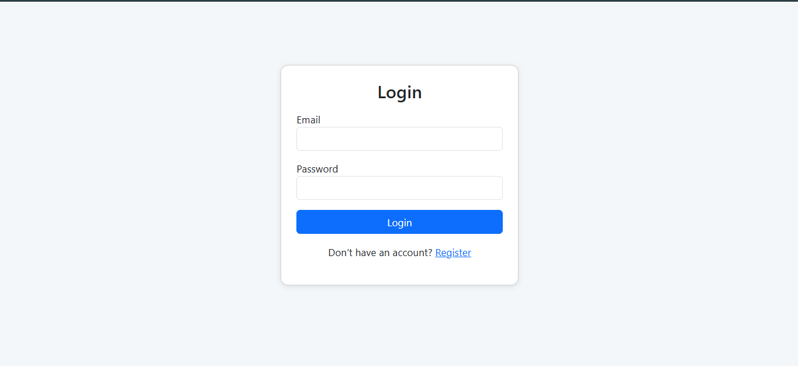
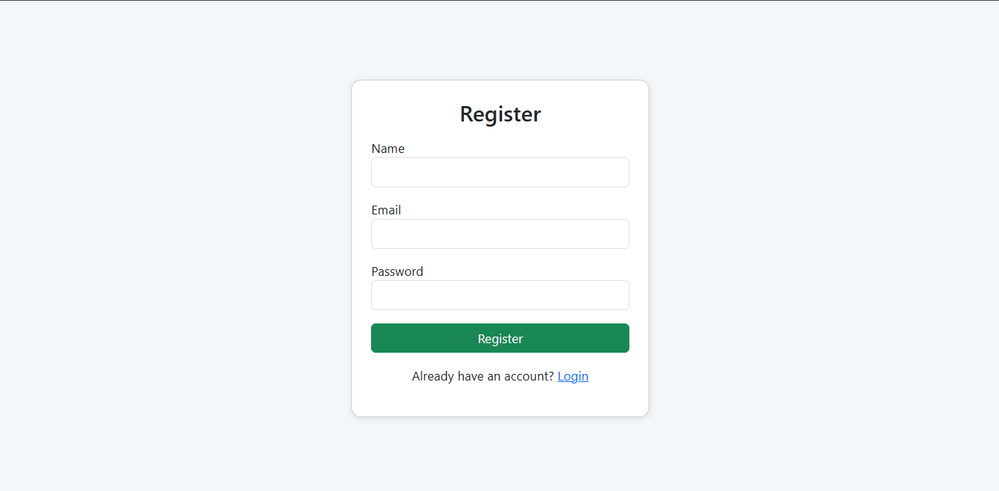

# User Authentication Frontend

This is the frontend application for the User Authentication System built using React and Vite.  
It connects to a Spring Boot backend and provides features such as JWT authentication, role-based access, and user audit visibility.

---

## Project Overview

This application allows:
- Users to register and log in securely.
- Admins to view and manage registered users.
- Both users and admins to view login and logout audit details.

The frontend communicates with the backend through REST APIs using Axios.

---

## Screenshots

| Page | Image |
|-------|--------|
| Login Page |  |
| Register Page |  |
| User Dashboard |  |
| Admin Dashboard |  |

---

## Tech Stack

- React (Vite)
- React Router DOM
- Axios
- Bootstrap 5
- Context API for authentication state management

---

